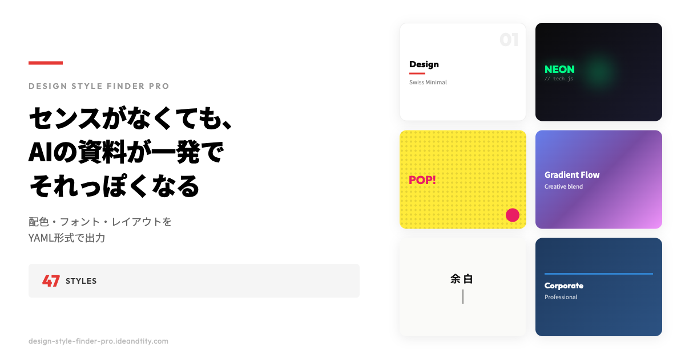

# デザインスタイルファインダー Pro

> センスがなくても、AIの資料が一発でそれっぽくなる

[](https://design-style-finder-pro.ideandtity.com/)
[](LICENSE)

47種類のプロ監修デザインスタイルから選ぶだけで、配色・フォント・レイアウトをYAML形式で出力。ChatGPTやNotebookLMに渡して、すぐにそれっぽいデザインの資料が作れます。



## 特徴

- **47種類のスタイル** - 6カテゴリに分類されたプロ監修のデザインスタイル
- **YAML出力** - AIが理解しやすい形式で配色・フォント・レイアウトを出力
- **用途別対応** - プレゼン / Web / アプリ / LP / SNS の5種類
- **リアルタイムプレビュー** - スタイルを選ぶと即座にプレビュー表示
- **スタイル比較** - 最大4つのスタイルを並べて比較
- **お気に入り機能** - 気に入ったスタイルをLocalStorageに保存

## カテゴリ

| カテゴリ | 説明 | スタイル数 |
|---------|------|-----------|
| ✨ ミニマル・洗練 | 余白を活かしたクリーンなデザイン | 10種 |
| 🚀 テック・先進的 | ダークモード、ネオン、グリッド | 8種 |
| 😊 親しみやすい・カジュアル | 丸みのある形、明るい色 | 8種 |
| 👑 プレミアム・高級感 | モノクロ、タイポグラフィ重視 | 7種 |
| 🎨 クリエイティブ | 大胆な色使い、ユニークな構成 | 8種 |
| 💼 ビジネス・信頼 | 整然としたレイアウト、信頼感のある配色 | 6種 |

## 使い方

1. **スタイルを選ぶ** - 47種類からイメージに合うものをクリック
2. **用途を選ぶ** - プレゼン・Web・アプリ・LP・SNSから選択
3. **YAMLをコピー** - コピーボタンをクリック
4. **AIに貼り付け** - 「このスタイルで○○を作って」と指示

## 対応AI

- ChatGPT
- Claude
- NotebookLM（スライド生成）
- Gemini
- その他、YAML/テキストを理解できるAI

## 技術スタック

- **HTML5** / **CSS3** / **Vanilla JavaScript**
- **Google Fonts** - Noto Sans JP, Outfit, Playfair Display など
- **Vercel** - ホスティング & 自動デプロイ

## ディレクトリ構造

```
design-style-finder-pro/
├── index.html          # メインページ（LP + ツール）
├── css/
│   ├── style.css       # ベーススタイル
│   ├── preview-styles.css  # 47スタイルのプレビュー
│   ├── themes.css      # テーマ適用スタイル
│   └── lp.css          # LPセクションスタイル
├── js/
│   ├── data.js         # スタイルデータ定義
│   └── app.js          # アプリケーションロジック
├── images/
│   ├── ogp.png         # OGP画像
│   ├── howto/          # 使い方GIF/画像
│   └── samples/        # サンプル作成例
├── favicon.svg         # ファビコン（SVG）
├── favicon-32x32.png   # ファビコン（PNG）
├── apple-touch-icon.png # Apple Touch Icon
├── vercel.json         # Vercel設定
└── package.json
```

## ローカル開発

```bash
# リポジトリをクローン
git clone https://github.com/locotown/design-style-finder-pro.git
cd design-style-finder-pro

# ローカルサーバーを起動
npm start
# または
npx serve .

# ブラウザで開く
open http://localhost:3000
```

## デプロイ

Vercelに自動デプロイ設定済み。`main`ブランチへのpushで自動デプロイされます。

```bash
# 手動デプロイ
npx vercel --prod
```

## ライセンス

MIT License

## 作者

[@locotown](https://github.com/locotown)

---

**Live Demo:** https://design-style-finder-pro.ideandtity.com/
